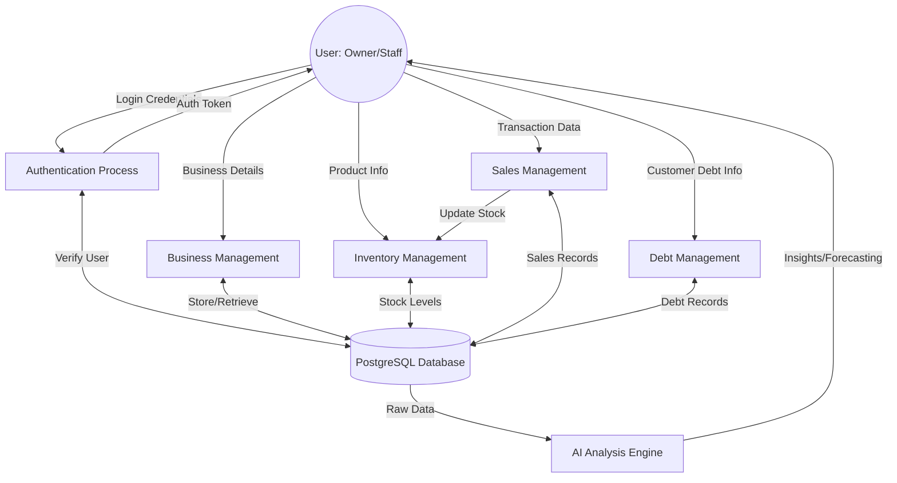
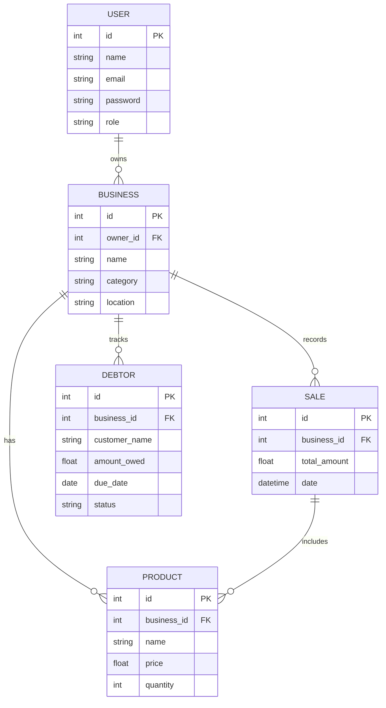

# TokBiz Diagrams

## 1. Data Flow Diagram (Level 1)


## 2. Entity Relationship Diagram (ERD)


## 3. Use Case Diagram
```mermaid
usecaseDiagram
    actor "Business Owner" as Owner
    actor "Staff" as Staff

    package "TokBiz Platform" {
        usecase "Login/Authenticate" as UC1
        usecase "Manage Business Profile" as UC2
        usecase "Manage Inventory" as UC3
        usecase "Record Sales" as UC4
        usecase "Track Customer Debts" as UC5
        usecase "View Analytics Dashboard" as UC6
        usecase "Get AI Business Insights" as UC7
    }

    Owner --> UC1
    Owner --> UC2
    Owner --> UC3
    Owner --> UC4
    Owner --> UC5
    Owner --> UC6
    Owner --> UC7

    Staff --> UC1
    Staff --> UC3
    Staff --> UC4
    Staff --> UC5
```
